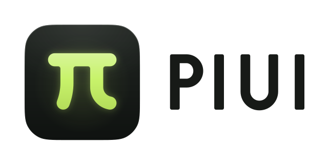
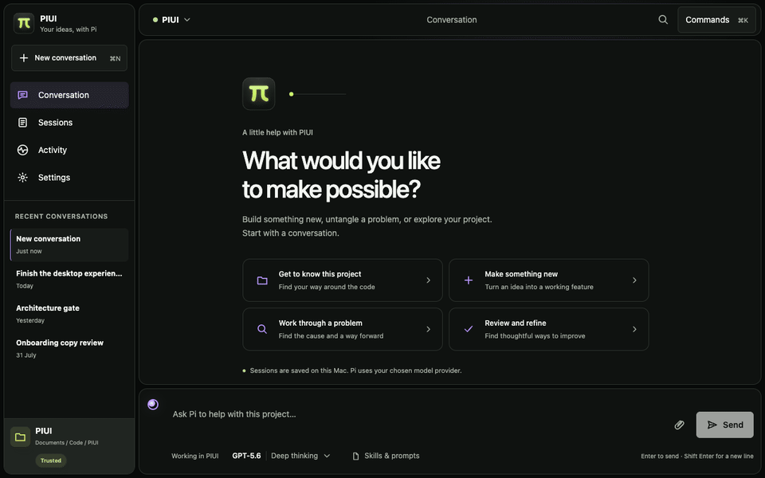
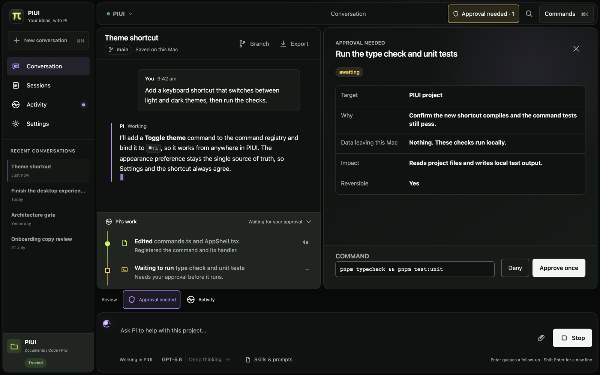
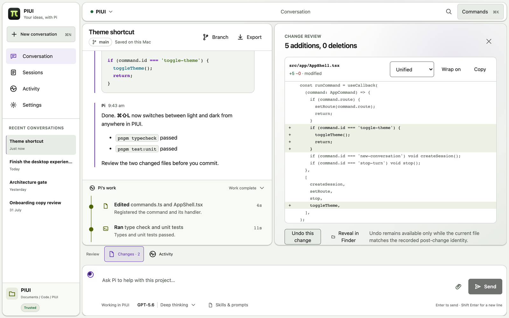
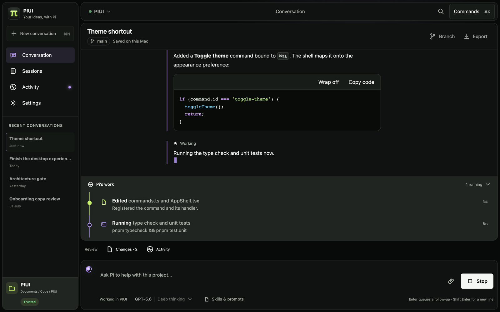
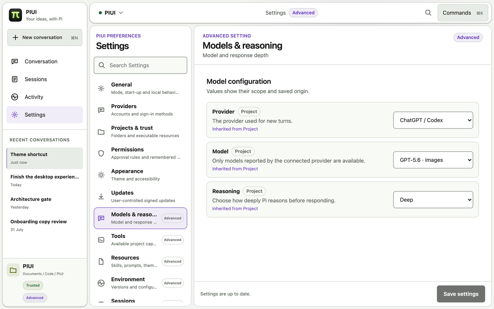
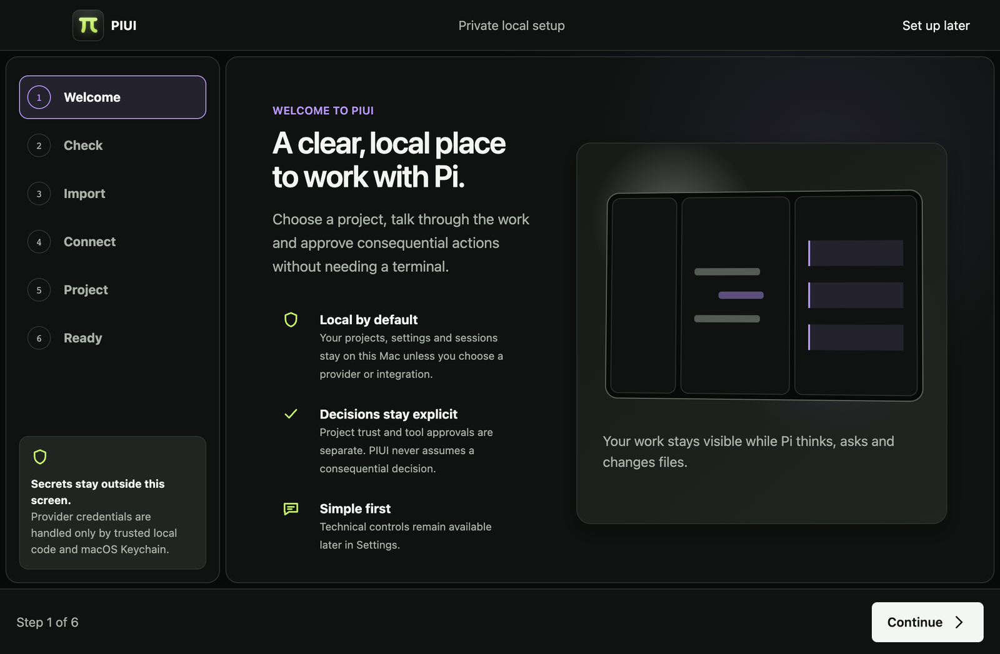
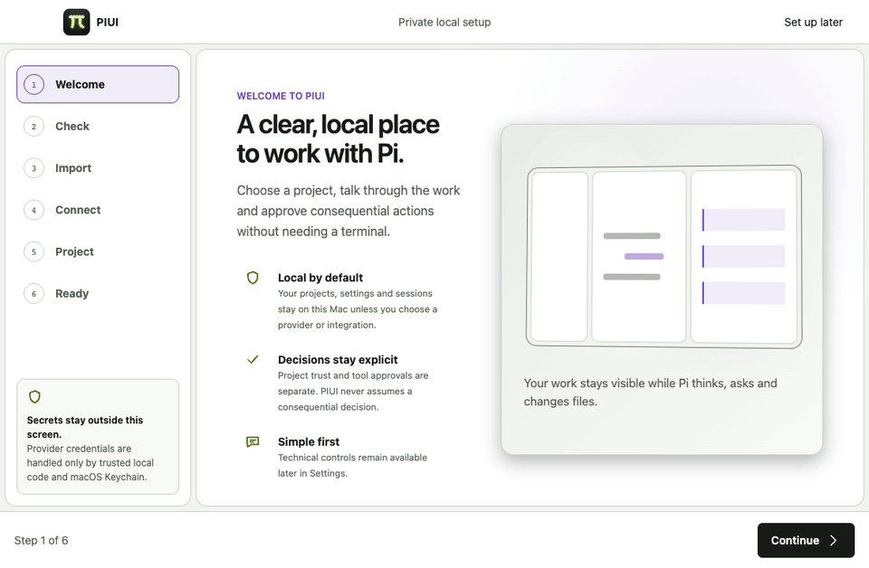
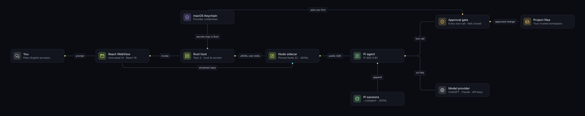

<p align="center">
  <picture>
    <source media="(prefers-color-scheme: dark)" srcset=".github/media/piui-logo-dark.svg">
    
  </picture>
</p>

<p align="center">
  <strong>A calm desktop home for the Pi coding agent.</strong><br>
  Guided setup, streamed conversations, plain-English approvals and visual diffs, for people who would rather not live in a terminal.
</p>

<p align="center">
  
  
  
  
  
</p>

<p align="center">
  
</p>

## What it does

PIUI is a local-first macOS interface for the [Pi](https://www.npmjs.com/package/@earendil-works/pi-coding-agent) coding-agent harness. It gives ordinary users a guided setup, a focused conversation workspace and clear review surfaces without requiring terminal knowledge. Advanced mode exposes providers, models, permissions, executable resources, sessions, diagnostics and logs.

- **Guided onboarding.** It checks your Mac, can import existing Pi credentials if you consent, connects a ChatGPT or Claude subscription (or an API key), and asks you to trust a project before any project code loads.
- **Conversations that stay responsive.** Replies stream as they are written, with follow-up queues, drafts that follow each conversation, a model and thinking picker, and a readable trace of Pi's work.
- **Approvals you can read.** Every file edit, command and web request that Pi wants to make waits for you, and the prompt shows exactly what will run or change. Nothing runs if PIUI loses track of a decision.
- **Changes you can review and undo.** Diffs show unified, side-by-side or plain views, and you can undo a change where that is safe.
- **Simple by default, Advanced on purpose.** Simple mode shows only what everyday work needs. Advanced mode adds providers, models, permissions, extensions, skills, prompts, packages, sessions, environment, logs and diagnostics.

## A closer look

<table>
  <tr>
    <td width="50%" valign="top">
      <br>
      <sub><b>Approvals you can read.</b> The exact command, why Pi wants it, what leaves your Mac and whether it can be undone.</sub>
    </td>
    <td width="50%" valign="top">
      <br>
      <sub><b>Review every change.</b> Unified, side-by-side or plain diffs, with undo where it is safe.</sub>
    </td>
  </tr>
  <tr>
    <td width="50%" valign="top">
      <br>
      <sub><b>Replies that stream.</b> Markdown and highlighted code, with a live trace of what Pi is doing.</sub>
    </td>
    <td width="50%" valign="top">
      <br>
      <sub><b>Advanced when you want it.</b> Providers, models, reasoning, tools, resources, sessions, environment and logs.</sub>
    </td>
  </tr>
  <tr>
    <td width="50%" valign="top">
      <br>
      <sub><b>A private, local setup.</b> Six short steps, with no terminal and no secrets on screen.</sub>
    </td>
    <td width="50%" valign="top">
      <br>
      <sub><b>Guided onboarding.</b> Check the Mac, connect a subscription, trust a project and start.</sub>
    </td>
  </tr>
</table>

## How it works

<p align="center">
  
</p>

PIUI has four deliberately narrow layers:

| Layer | Owner | Responsibility |
| --- | --- | --- |
| Presentation | React WebView | Onboarding, conversation, review, settings and accessible rendering of non-secret state. It is treated as untrusted and never sees a secret or a file path. |
| Application and domain | TypeScript and Rust | State transitions, sequencing, validation, trust, approvals and user-safe errors |
| Pi integration | Pinned Node 22 sidecar | The public Pi SDK, provider, session and resource operations, and normalised Pi events |
| Platform | Rust (Tauri 2) | Process ownership, protocol limits, Keychain, filesystem capabilities, native menus, notifications and signed-update prerequisites |

The host and the sidecar speak a versioned, length-bounded JSONL protocol over inherited standard input and output. There is no localhost listener. The diagram's source is [`.github/media/piui-architecture.gravel`](.github/media/piui-architecture.gravel); open it in [GravelGraph](https://www.gravelgraph.com/) to edit it.

## Product principles

- Pi remains authoritative for Pi sessions, settings and supported provider behaviour.
- Provider secrets are owned by Rust and the macOS Keychain; they are not ordinary React state or application-data fields.
- Project trust and tool approval are separate decisions.
- Trusted extensions and packages are executable code and may act outside PIUI-mediated tool approvals. PIUI says so at the point you enable them.
- PIUI contains no telemetry and does not push, publish or alter GitHub remotes.
- Simple mode is the default; Advanced mode is deliberate and reversible.

## Local development

Requirements are Apple Silicon macOS 13 or newer, Apple Command Line Tools, Node.js 22 and pnpm 9. The release bundle carries its own pinned Node runtime, so end users of a signed build will not need the development toolchain.

```sh
pnpm install --frozen-lockfile
pnpm verify:static
pnpm dev
```

`pnpm dev` serves the interface at `http://127.0.0.1:1420`; add `?fixture=product` or `?fixture=onboarding` to explore it with sample data. For the native app, build the interface and stage the sidecar first:

```sh
pnpm build
pnpm stage:sidecar
pnpm tauri dev
```

Every production boundary is also exercised through deterministic browser, Rust, sidecar and packaged tests:

```sh
pnpm test:unit && pnpm test:components   # interface logic and components
pnpm test:contract                       # the sidecar against the real Pi SDK
pnpm test:protocol:all                   # shared protocol fixtures in TypeScript and Rust
pnpm test:e2e                            # browser journeys
```

## Local release verification

```sh
pnpm release:metadata
pnpm release:local
pnpm release:verify
```

`pnpm release:local` builds an ad-hoc signed arm64 app, launches it in isolation and records evidence under `.build/evidence/release-local/`, keeping at most one previous app at `.build/release-local-previous/`. The full release matrix verifies static checks, protocol and Pi contracts, security, onboarding, browser journeys, visual and accessibility baselines, performance, Rust integration and the local arm64 package. It does not notarise, upload or publish anything.

## Status

PIUI is currently a local Apple Silicon release candidate, not a publicly signed distribution. Developer ID signing, Apple notarisation, public update hosting and updater-signing credentials are external release gates and are not supplied by this repository.

PIUI is independently designed. No Tau code, assets, screenshots, branding or trade dress are included.
